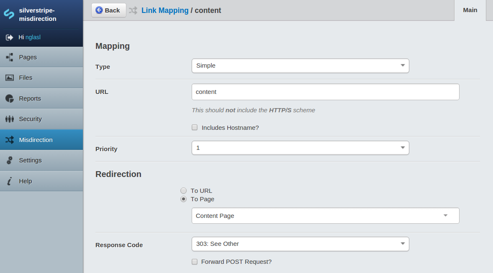
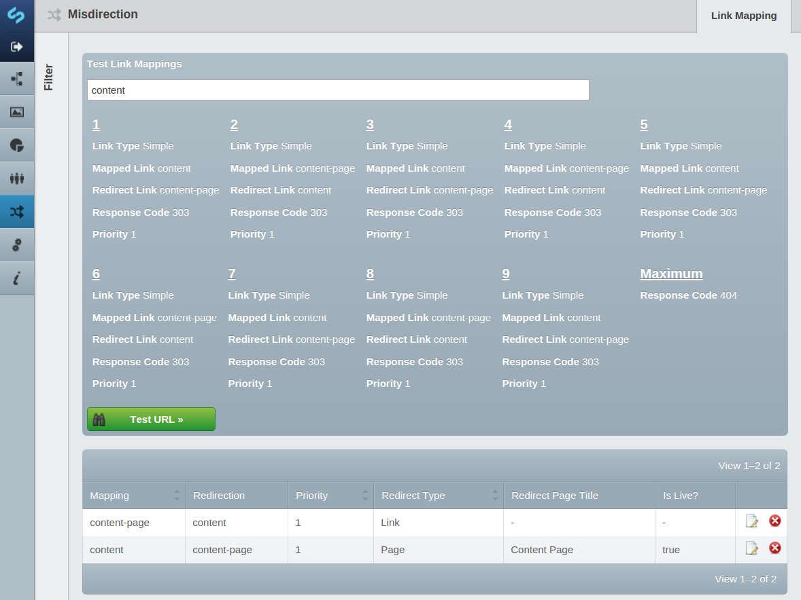

# [misdirection](https://packagist.org/packages/nglasl/silverstripe-misdirection)

_The current release is **2.0.1**_

	A module for SilverStripe which will allow both simple and regular expression link
	redirections based on customisable mappings, either hooking into a page not found or
	replacing the default automated URL handling.

This is based upon the existing [link mapping](https://github.com/silverstripe-australia/link-mapping) module, aiming to provide a more robust solution for both users and developers alike, with further support and customisation!

## Requirement

* SilverStripe 3.1.X

This module does **not** require the CMS.

## Getting Started

* Place the module under your root project directory.
* `/dev/build`
* Select `Misdirection` through the CMS.
* Create link mappings.

## Overview

### Link Mappings

These allow both simple and regular expression link redirections, based on priority and specificity. They can be used for legacy page redirection, vanity URLs (more below), or redirection based on specific URL patterns.



The link mapping with the highest priority and greatest specificity will be used, and replaces the default automated URL handling out of the box. This default behaviour may be configured to only hook into a page not found:

```yaml
MisdirectionRequestFilter:
  enforce_misdirection: false
```

When there are multiple matches, the link mapping first created will be used. This default behaviour may be configured to prioritise the link mapping most recently created:

```yaml
LinkMapping:
  priority: 'ASC'
```

### Vanity URLs and Fallbacks


#### Vanity URLs

While it is possible to create these manually (as above), a content author may directly create a link mapping from a page. However, it should be noted that these are instantiated with a low priority of `2`, and therefore other link mappings with higher priority will take precedence.

#### Fallbacks

A fallback will be triggered when a user happens to encounter a page not found. It is possible for an administrator to configure a global fallback through the site configuration, however a specific page setting will take precedence.

* Select `Settings`
* Select `Pages`

### What's Happening?

The link mappings are processed server side to prevent inefficient mappings and infinite recursion, using a request filter.

When you want to see exactly what is happening behind the scenes for a given URL, the model admin provides a powerful testing interface!


Once the maximum number of requests has been reached, the server will respond with a page not found. The following is the default configuration:

```yaml
MisdirectionRequestFilter:
  maximum_requests: 9
```



### Bypassing Misdirection

It's possible to bypass the request filter completely, by appending `?direct=1` to the URL. This is fantastic for debugging, however does not apply to the testing interface for obvious reasons.

### Default Automated URL Handling

This may be completely replaced by using the following, in which case legacy page URLs are no longer automatically resolved without link mappings being in place.

```yaml
MisdirectionRequestFilter:
  replace_default: true
```

#### Misdirection Historical Link Mapping Task

The following may be used to instantiate a link mapping for each site tree version URL, when replacing the default automated URL handling (currently only supported by MySQL).

`/dev/tasks/MisdirectionHistoricalLinkMappingTask`

#### Site Tree Automatic Link Mapping

When the URL segment of a site tree element has been updated, a link mapping will automatically be created. This functionality will be removed as soon as you enable SilverStripe's default automated URL handling (as it will no longer be required).


## Maintainer Contact

	Nathan Glasl, nathan@silverstripe.com.au
